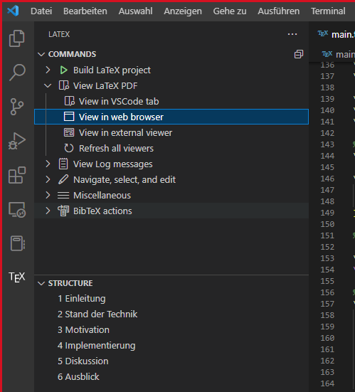
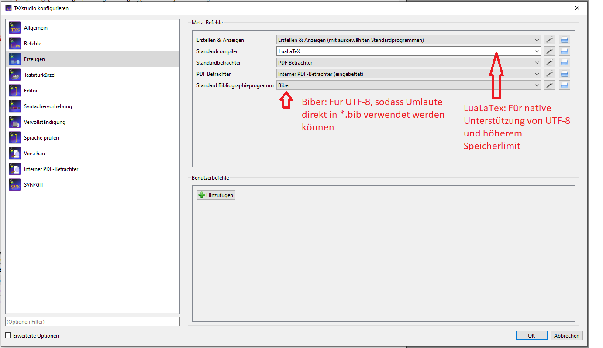
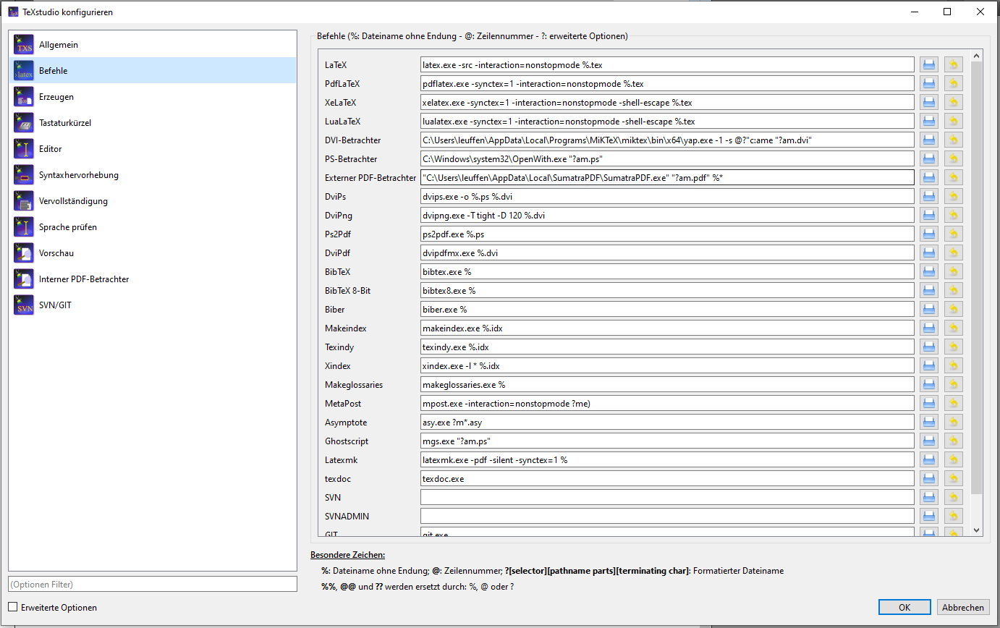

# Thesis template

Dies ist das Latex template der Grupope E/E zur Erstellung der Dissertation.

Zur Nutzung müssen MikText (Windows) oder Texlive (Linux) sowie Pyhton3 und Perl installiert sein.
Als Entwicklungsumgebung sind Visual Studio Code oder TextStudio empfohlen.

Zur Verwaltung der Quellen ist Jabref empfohlen, welches nativ mit dem *.bib-FOrmat von Latex arbeitet.

## Windows

MikTex installieren
(https://miktex.org/)

Perl installieren.
(https://strawberryperl.com/)

Python3 installieren (einschließlich "pip")
(https://www.python.org/downloads/)

Danach ggf. Ab- und Anmelden, damit PATH-Variablen vorhanden sind.

PowerShell öffnen und Pygments installieren
```console
pip install Pygments
```

## Linux (Ubuntu)
Texlive und python installieren:
```console
sudo apt install texlive-full python-is-python3 python3-pygments perl
```


## Entwicklungsumgebung

Als Entwicklungsumgebunge sind Visual Studio Code oder TexStudio empfohlen.

### Visual Studio Code

VS Code installieren (exe für Windows, deb für Linux)
(https://code.visualstudio.com/)

Plugin installieren:
LaTeX Workshop (James Yu)

Beim speichern wird automatisch kompiliert.

Vorschau:


### TexStudio

Textstudio muss für die Vorlage konfiguert werden:

__Verwendung von Lualatex__



__Shell Escape__




## Bibliothek

Zur Quellenverwaltung ist JabRef emfphohlen.
(https://www.jabref.org/)

Hierzu gibt es außerdem ein Browser-Plugin für Firefox und Chorme, welches den Import der im Internet gefunden Literatur in das Quellenverzeichnis automatisiert.